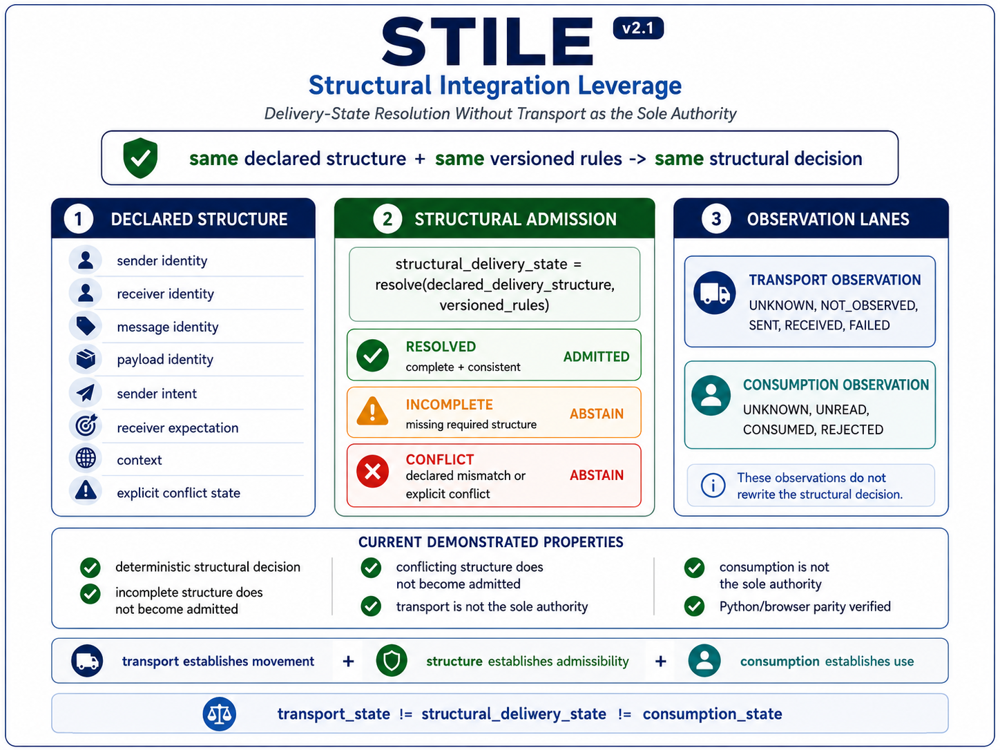

# ⭐ STILE

**Structural Integration Leverage — Correctness Without Communication**

The ~1.37 KB reference kernel that demonstrates:
delivery correctness does not require communication, acknowledgements, retries, or network dependency.


---

STILE removes communication as a dependency for correctness.

A message does not need to be sent, confirmed, retried, or acknowledged to be considered delivered.

Delivery is admitted only when structure is aligned.

Deterministic • Structure-Based • No Communication • No Retries • No Acknowledgements • No Network

---

## ⚡ The Claim

A valid result can be determined without communication, interaction, or transmission — when structure is sufficient.

---

## 🧱 The Unifying Principle

`correctness = resolve(structure)`

For STILE:

`message_delivered iff structure_aligned`  
`delivery_visible iff structure_aligned`

If correctness remains after removing a dependency, that dependency was never fundamental.

---

## 🌍 Civilizational Impact

From uncertainty to structural certainty.

Traditional systems inherit:  
Uncertainty • Delay • Ambiguity  

STILE systems inherit:  
Certainty • Determinism • Clarity  

This is not an optimization.  
This is the removal of a non-fundamental dependency.

Delivery was never created by communication.  
It is determined by structure.

Communication may carry structure.  
It does not create correctness.

**Scope Note:**  
This reference model demonstrates the principle.  
Real-world systems may still use transport layers —  
they simply cease to be the source of truth.

---

## ⚠️ Clarification — Machine-Level Evaluation

This reference kernel runs as a minimal Python program and may perform internal evaluation.

However, this evaluation is **NOT communication** and is **NOT the source of correctness**.

Correctness is determined solely by structural sufficiency —  
not by network interaction, acknowledgements, retries, or message exchange.

Evaluation functions only as a resolution substrate, not as a source of correctness.

---

## 🧠 Practical Interpretation

Use existing systems to transport messages.

Use STILE to resolve and validate when delivery is structurally true.

---

## 🧱 Layer Separation (Critical)

**Structure Layer:**  
determines delivery truth  

**Representation Layer:**  
messages, APIs, transport (optional)  

**Execution Layer:**  
network, retries, acknowledgements (optional)  

STILE operates only at the Structure Layer.

Transport may exist.  
It is not the source of correctness.

---

## 🔍 Truth vs Transport

STILE determines delivery truth, not transmission.

It establishes whether a message is structurally delivered.

Real-world transport, messaging, or communication may still belong to execution layers.

Delivery is not a transport event.  
Delivery is a structural admission.

Delivery is not triggered by sending.  
It is admitted by structure.

Silence is not failure.  
Silence is a valid structural state.

---

## 🔥 Break This STILE (Immediate Challenge)

If communication is required for correctness, this invariant must fail:

`same structure -> same delivery state -> same certificate`

More precisely:

S1 = S2  
DeliveryState1 != DeliveryState2 OR Certificate1 != Certificate2  

Or demonstrate:

incomplete structure -> forced delivery  
conflicting structure -> arbitrary delivery  
reordered identical structure -> different outcome  

If none occur, communication is not fundamental.

---

## 🌍 A World Built on Communication

For decades, systems have been built on dependencies:

communication  
acknowledgements  
retries  
delivery pipelines  
network infrastructure  

Each treated as essential.

---

## 🔄 The Shift

Across domains:

correctness does not depend on the mechanism we assumed it did  

It is preserved by:

**structure**

---

## 🧱 Dependency Elimination Framework

Domain        | Removed Dependency            | What Preserves Correctness
--------------|-------------------------------|----------------------------
Messaging     | Network / ACKs / Retries      | Structure
Finance       | Continuous connectivity       | Structure (STINT)
Time          | Clocks                        | Structure (STIME)
Computation   | Execution                     | Structure (SLANG)
AI / Agents   | Constant inference            | Structure
Integration   | Communication / Coordination  | Structure

Each row removes a dependency — yet correctness remains intact.

Nothing is replaced.  
Nothing is approximated.  
Only the dependency is eliminated.

---

## ⚡ The One-Line Breakthrough

Delivery does not require communication — when structure is sufficient.

---

## ⚡ The Core Truth

`delivery != transmission`  
`delivery = resolve(structure)`

Communication may carry delivery.  
It does not create it.

---

## ⚡ Structural Absence Principle

If structure is not complete and consistent:  
delivery does not exist.

This is not delay.  
This is not failure.  

This is structural absence.

`incomplete -> no delivery`  
`conflict -> no delivery`  
`absence = structural truth`

---

## ⚡ Try it in 30 seconds

**Demo 1 — Core STILE proof**

```
python demo/stile_message_delivery.py
```

**Optional Demo 2 — OTP without sending**

```
python demo_otp/otp_without_sending.py
```

---

## 🔍 What You Will Observe

deterministic delivery resolution  
no communication dependency  
no retries  
no acknowledgements  
incomplete structure produces no delivery  
conflicting structure produces no delivery  
identical structure produces identical delivery  

---

## 🧩 Reference Demonstration

**Scenario 1 — Valid Alignment**  
→ delivery appears  

**Scenario 2 — Misalignment**  
→ message_delivered does not appear  

**Scenario 3 — Conflict Present**  
→ message_delivered does not appear  

**Scenario 4 — Incomplete Structure**  
→ ABSTAIN (safe silence)

---

## 🔹 What this output represents

• message_delivered appears only when structure is aligned  
• structure_aligned = True governs visibility  
• sigma is deterministic  

Traditionally dependent on communication.  
Here: purely structural.

---

## 🧭 Visual Overview



---

## 🧭 Framework & References

**Docs**
- [Quickstart](docs/Quickstart.md)  
- [FAQ](docs/FAQ.md)  
- [Proof Sketch](docs/Proof-Sketch.md)  
- [STILE Concept Diagram](docs/STILE-Message-Delivery.png)  
- [STILE Structural Flow Diagram](docs/STILE-Message-Mermaid-Diagram.png)  

**Framework**

- [STILE Framework Document](docs/STILE_v1.2.pdf)
- [STILE Architecture Notes](docs/STILE-Architecture-Notes.md)
- [Dependency Elimination Framework](docs/Dependency-Elimination-Framework.png)
- [Shunyaya Structural Stack](docs/Shunyaya-Structural-Stack.png)

Part of the Dependency Elimination Framework — where removing assumed dependencies reveals that correctness is preserved by structure alone.

---

## **Demo**
- [demo/stile_message_delivery.py](demo/stile_message_delivery.py)
- [demo/stile_message_delivery.html](demo/stile_message_delivery.html)

Optional extension:
- [demo_otp/otp_without_sending.py](demo_otp/otp_without_sending.py)  
  Demonstrates OTP verification without SMS, email, or network transport.

---

## **Verification**
- [VERIFY/VERIFY.txt](VERIFY/VERIFY.txt)  
- [VERIFY/FREEZE_DEMO_SHA256.txt](VERIFY/FREEZE_DEMO_SHA256.txt)

---

## **Repository**
- [demo/](demo/) — kernel  
- [docs/](docs/) — explanation  
- [VERIFY/](VERIFY/) — reproducibility  

---

## ⚡ The Core Structural Model

`message_delivered iff structure_aligned`

`structure_aligned = complete AND consistent`

`resolve(structure) ->`

RESOLVED   if structure_aligned  
ABSTAIN    if structure is incomplete  
CONFLICT   if structure is inconsistent  

---

## ⚠️ Read This Carefully

This is not:
- a messaging protocol
- a communication system
- a retry optimization
- a network replacement

Communication is not required for correctness.

Scope Note:  
The reference kernel performs internal evaluation.  
This evaluation is not communication and is not the source of correctness.  
Correctness is determined solely by structural sufficiency.

---

## 🔥 What This Proves

This kernel proves that delivery correctness does not require:

communication  
retries  
acknowledgements  
network  
message queues  

---

## 🔥 Structural Resolution Model

`resolve(structure) ->`  
RESOLVED  
ABSTAIN  
CONFLICT  

---

## 🛡 Structural Safety Model

`incomplete -> no forced delivery`  
`conflicting -> no arbitrary delivery`  
`complete -> deterministic delivery`

---

## 🔐 Structural Certificate

`same structure -> same delivery -> same certificate`

---

## 🔥 Deterministic Guarantee

`same structure -> same delivery -> same certificate`

`different structure -> different admissibility outcome`

No communication, retries, acknowledgements, or sequence  
can alter this invariant.

---

## ⚖️ What This Proves / Does Not Prove

**Proves**
delivery admissibility from structure  
deterministic outcomes  
communication independence  

**Does NOT Prove**
message transport  
network elimination  
latency optimization  

---

## 📊 Comparison

Model                  | Communication Required | Structure-Based | Deterministic
-----------------------|------------------------|-----------------|--------------
Traditional Messaging  | Yes                    | No              | Conditional
STILE                  | No                     | Yes             | Yes

---

## 🔁 Deterministic Guarantees

`S1 = S2 -> DeliveryState1 = DeliveryState2 -> Certificate1 = Certificate2`

Order Independence  
Idempotence  

---

## 🧠 Critical Insight

System does not:

communicate  
retry  
acknowledge  

It resolves structure.

---

## 🧠 Structural Truth

A message may be sent.  

But structural delivery may not exist.

The system does not guess.  
The system does not retry.  

It simply refuses to grant delivery  
to what structure does not support.

`absence != failure`  
`absence = structural truth`

---

## 🌌 Why This Is Bigger Than It Looks

Minimal proof that:

delivery correctness does not require communication  
outcomes do not depend on interaction  
alignment reveals truth  

---

## 🧾 Structural Lineage

SLANG-Computation → correctness without execution  
STIME → correctness without time  
STINT-Money → correctness without connectivity  
STRAL-Path → correctness without traversal  
STILE → correctness without communication  

---

## 🧪 Try it yourself

Copy the demo kernel and run it locally.

Then test the same pattern across your own domain:

APIs & microservices  
Offline-first applications  
Disaster-response coordination  
Financial settlement  
Healthcare record exchange  

Change one structural condition at a time:

intent mismatch -> no delivery  
missing identity -> no delivery  
conflict present -> no delivery  
pending context -> ABSTAIN  
aligned structure -> delivered  

The goal is not to send a message.

The goal is to verify whether delivery becomes structurally admissible.

---

## 📜 License

See: [LICENSE](LICENSE)

**Reference Implementation (This Repository):**

This tiny kernel is the official minimal example of the STILE model.  
It demonstrates the core principle in its simplest form.

Released as an **Open Standard** — free to use, study, implement, extend, and deploy.

**Architecture and Documentation:**  
CC BY-NC 4.0

---

## 🔭 Roadmap (Exploratory)

| Milestone                        | Description                                                   | Status     |
|---------------------------------|---------------------------------------------------------------|------------|
| Structural alignment classification | Auto-detect complete, incomplete, and conflicting structure | Planned    |
| Multi-party alignment           | Extend structural resolution beyond two-party systems          | Planned    |
| Canonical certificates          | Normalized delivery identity across representations            | Planned    |
| OTP without sending             | Prove possession of a code without transmission                | Prototype  |
| Language ports                  | Go, Rust, and TypeScript reference kernels                    | Open       |
| Domain packs                    | Pre-built structural models for finance, healthcare, and IoT  | Open       |

**Next milestone target:**  
v1.2 — Multi-party alignment + canonical certificate specification

---

## 🔗 Related Structural References

- [ORL](https://github.com/OMPSHUNYAYA/Orderless-Ledger) — ledger correctness from structure without ordering
- [STOCRS](https://github.com/OMPSHUNYAYA/STOCRS) — computation from structure without execution
- [STIME](https://github.com/OMPSHUNYAYA/Structural-Time) — time from valid structural transitions
- [SSUM-Time](https://github.com/OMPSHUNYAYA/SSUM-Time) — structural clock for time reconstruction and recovery
- [STRAL-Path](https://github.com/OMPSHUNYAYA/STRAL-Path) — path correctness from structure without traversal, graph search, or ordered exploration
- [SLANG-Computation](https://github.com/OMPSHUNYAYA/SLANG-Computation) — computation correctness from structure without execution flow, control flow, or prescribed sequencing
- [STINT-Money](https://github.com/OMPSHUNYAYA/STINT-Money) — financial correctness from structure without continuous connectivity, synchronization, or ordered communication

---

### 🧭 Final Statement

Communication did not create delivery correctness.  
Transmission did not create delivery correctness.  
Interaction did not create delivery correctness.  

**Delivery is not created by communication.**  
**It is determined by structure.**
